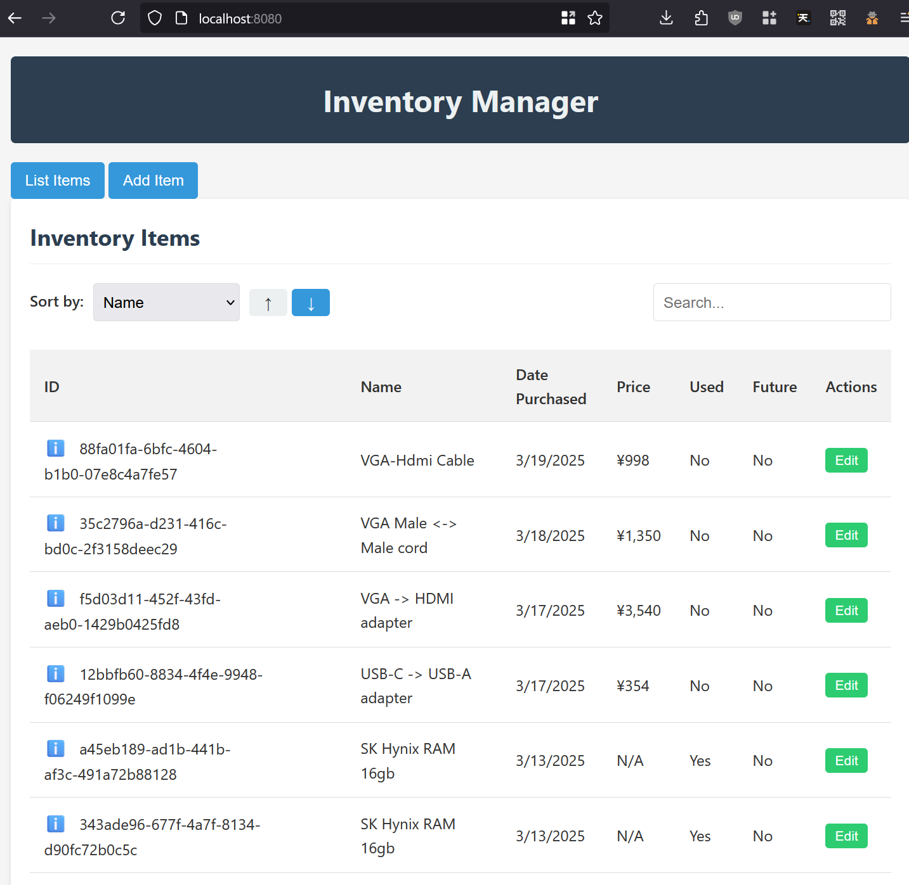

# Inventory Management

This project is an experiment in using various LLMs with MCP servers to code something useful.

# Structure

* Rust CLI
  * Handles interaction over stdio / cli with the backing database file
* Web
  * Server
    * Go http server that serves the frontend and relays requests to/from the Rust CLI
  * Frontend
    * Plain JS/HTML/CSS AJAX app that posts responses to and from the Server
* MCP Server
  * Separate standlone server that uses the Web Server to interact with the Rust CLI for providing LLM tools 

## Methodology

This project is conducted in a majority hands-off way to see how good agentic coding can be. The main MCP Client of choice was [5ire](https://github.com/nanbingxyz/5ire).

The models used are:  
* Claude 3.5 Sonnet  
* Claude 3.7 Sonnet  
* Mistral Codelarge  

Model switching happened when one timedout or produced token errors. By and large the preference was for 3.7 sonnet when available, but 3.5 for the main fallback.
  
MCP Servers used are:  
* [Claude Filesystem](https://modelcontextprotocol.io/quickstart/user#2-add-the-filesystem-mcp-server)
* [Cnosuke's SQLite](https://github.com/cnosuke/mcp-sqlite)

Halfway through, the Git MCP server was added to do automatic commits.

The SQLite schema was made before this project became an MCP/LLM demo, but everything around it including the Rust CLI, the Go server and the HTML app came from the vibe coding.