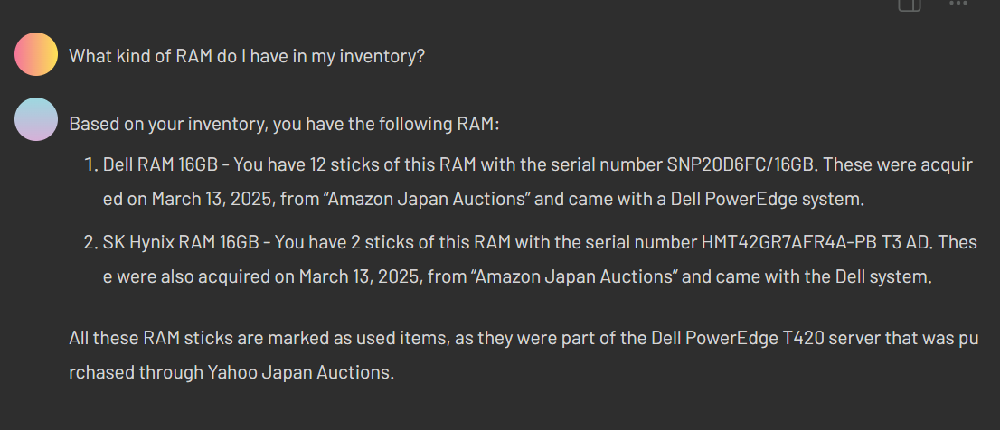
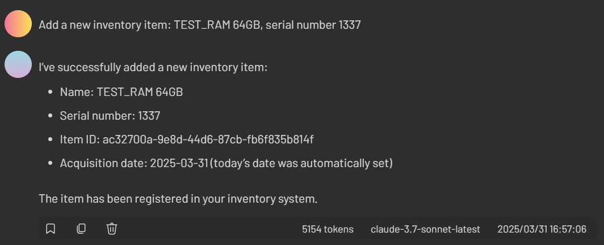

# Inventory Management

This project is an experiment in using various LLMs with MCP servers to code something useful.

## This project comes with an MCP server as well

# Structure

* Rust CLI
  * Handles interaction over stdio / cli with the backing database file
* Web
  * Server
    * Go http server that serves the frontend and relays requests to/from the Rust CLI
  * Frontend
    * Plain JS/HTML/CSS AJAX app that posts responses to and from the Server
* MCP Server
  * Separate standlone server that uses the CLI for providing LLM tools 
* Shared
  * A go module that contains common items between the MCP server and the Web server, for interfacing wit the CLI

## Methodology

This project is conducted in a majority hands-off way to see how good agentic coding can be. The main MCP Client of choice was [5ire](https://github.com/nanbingxyz/5ire).

The models used are:  
* Claude 3.5 Sonnet  
* Claude 3.7 Sonnet  
* Mistral Codelarge  

Model switching happened when one timedout or produced token errors. By and large the preference was for 3.7 sonnet when available, but 3.5 for the main fallback.
  
MCP Servers used are:  
* [Claude Filesystem](https://modelcontextprotocol.io/quickstart/user#2-add-the-filesystem-mcp-server)
* [Cnosuke's SQLite](https://github.com/cnosuke/mcp-sqlite)

Halfway through, the Git MCP server was added to do automatic commits.

The SQLite schema was made before this project became an MCP/LLM demo, but everything around it including the Rust CLI, the Go server and the HTML app came from the vibe coding.

### Interventions

Unfortunately, Vibe Coding got 80% of the way there but was not able to complete some critical parts of the project. 
* The `--filter` command for instnce, proved almost impossible for the models to implement correctly, although it got there in the end after some substantial hand-holding.
* The llms would often overwrite entire files with just a snippet, instead of the full file contents, resulting in lots of build errors. Having a decent git commit history was helpful to revert these changes.
* *SQL injection was a big problem -- the model could not be made to understand and fix it's own injection errors. Intervention had to happen here as well, with some manual overwrtiing. 
* The models have memory issues: They would switch to python semi-randomly, and forget what directories and files it was working with, despite being reminded only a handful of messages ago. 